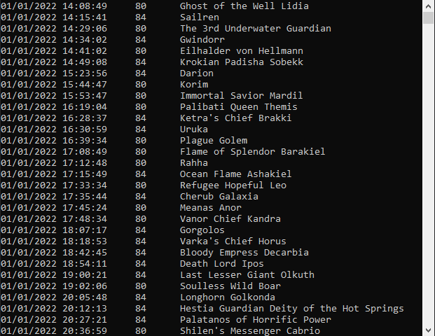
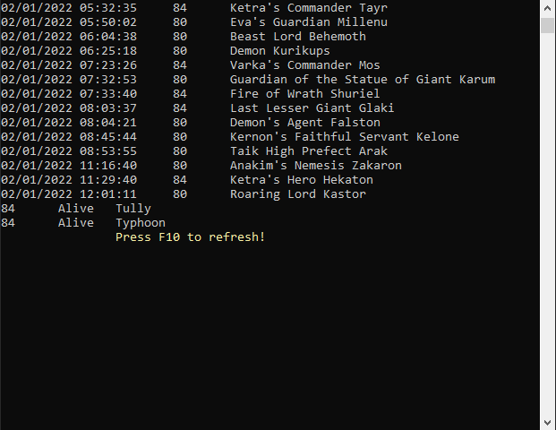

# Raid_Boss_Status_Exilium_World
Console app to scrap informations about raid boss status.
## Table of Contents
* [General Info](#general-informations)
* [Features](#features)
* [Screenshots](#screenshots)
* [Project Status](#project-status)
* [Contact](#contact)
## General Informations
Simple console application for web scraping in C#. The website provides status about raid bosses which include Name, Level, Status and Spawn time, but show them without any sorting options what makes players hard to stay up to date when which raid boss going to spawn. That short console app scrap web page about raid boss status and sort them by level and spawn time.
## Technologies Used
- HtmlAgilityPack 1.11.39
## Features
- Display Raid Boss Status
- Refresh Raid Boss Status
## Screenshots

## Project status
Project is: complete.
## Contact
Created by @szy.szymalski@gmail.com - feel free to contact me!
